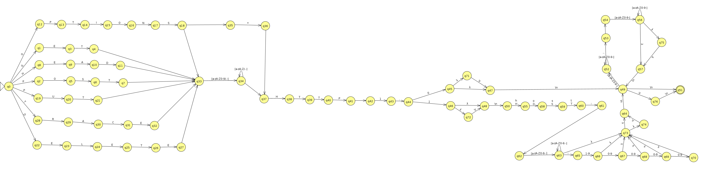

# 🚀 LFA - Lexic HTTP Requests Validator
This project is a HTTP request lexic validator developed in Python 3 utilizing the `automathon` library to create a Finite Automaton. The validator checks the syntax of HTTP requests according to versions 1.0 and 1.1.

The following image is a simplified visualization of implemented automata.

The [automata file](./automata.jff) `.jff` can be open using [JFLAP](https://www.jflap.org/).

You can find the full explained implementation in the [Jupyter file](./http-header-parser.ipynb).

### 📚 Resources:
- [Automathon Library](https://github.com/rohaquinlop/automathon)
- [HTTP/1.0 Specification](https://datatracker.ietf.org/doc/html/rfc1945)
- [HTTP/1.1 Specification](https://datatracker.ietf.org/doc/html/rfc2616)

### 📝 License:
This project is licensed under the [MIT License](LICENSE). Feel free to use, modify, and distribute it as per the terms of the license.
